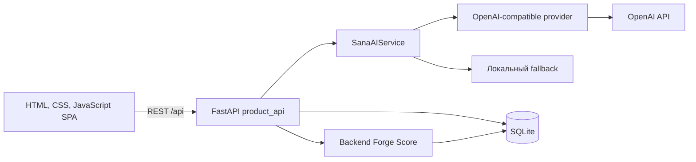

# SANA FORGE

**AI-платформа для превращения краткой бизнес-проблемы в понятный и готовый к работе Challenge для студенческих команд AI Sana.**

[Репозиторий проекта](https://github.com/BAITC-Hacks/hack-10e6bc0b-educode)

## О проекте

Бизнес часто формулирует задачу слишком кратко: без описания пользователей, доступных данных, ожидаемого результата, критериев успеха и ограничений. Студенческой команде сложно оценить такую задачу и подготовить реалистичное предложение.

SANA FORGE проводит представителя бизнеса через единый сценарий:

```text
IDEA → REFINE → CONFIRM → SCORE → PUBLISH
```

SANA AI анализирует исходное описание, определяет недостающую информацию и задаёт уточняющие вопросы. После ответов бизнес редактирует и подтверждает итоговую карточку. Backend рассчитывает прозрачный Forge Score, а опубликованный Challenge становится доступен всем командам в каталоге. Команды отправляют предложения, бизнес вручную выбирает исполнителей и подтверждает выполненные этапы.

Проект рассчитан на:

- представителей бизнеса, которым нужно качественно сформулировать практическую задачу;
- студенческие команды AI Sana, которые ищут реальные Challenges и предлагают решения;
- организаторов, которым нужен понятный сквозной процесс от идеи до подтверждённого результата.

## Что реализовано

### Конструктор Challenge

- свободный ввод исходной бизнес-проблемы;
- выбор темы: `AI-ML`, `Education`, `FinTech`, `Smart City`, `Healthcare` или `Other`;
- проверка входных данных через Pydantic;
- минимум три уточняющих вопроса;
- адаптивное интервью до предварительной готовности не ниже 80 баллов и заполнения ключевых полей;
- Forge Missions: `DEFINE THE WIN`, `UNLOCK THE DATA`, `SET THE BOUNDARIES`, `CONNECT WITH TEAM`;
- редактируемый Challenge Canvas;
- обязательное подтверждение карточки представителем бизнеса перед публикацией.

Challenge Canvas содержит:

- название;
- контекст;
- потребность;
- пользователей;
- данные и материалы;
- ограничения;
- ожидаемый результат;
- критерии успеха;
- контакт;
- формат взаимодействия.

### SANA AI

- анализ известной и недостающей информации;
- генерация структурированного результата по JSON Schema;
- формирование уточняющих вопросов и подсказок;
- обратная связь по ответу и выбор формулировки следующего вопроса;
- сохранение неизвестных фактов как `null`;
- schema validation перед использованием ответа модели;
- локальный fallback при отсутствии API-ключа, ошибке сети или некорректном ответе модели;
- отдельный API-статус, который показывает активный режим без раскрытия ключа.

AI не рассчитывает Forge Score, не назначает команду и не принимает решение за бизнес. Выбор поля для следующего вопроса, оценка готовности и все баллы остаются в backend-коде.

### Forge Score

Forge Score рассчитывается детерминированно на backend только по заполненным и подтверждённым бизнесом полям.

| Категория | Максимум |
| --- | ---: |
| Контекст + потребность | 20 |
| Данные и материалы | 20 |
| Ожидаемый результат | 15 |
| Критерии успеха | 15 |
| Ограничения | 10 |
| Пользователи | 10 |
| Связь с бизнесом | 10 |
| **Итого** | **100** |

Уровни готовности:

| Баллы | Уровень | Значение |
| ---: | --- | --- |
| 0–39 | `RAW` | Черновик |
| 40–69 | `SHAPING` | Рабочая задача |
| 70–89 | `READY` | Готовая задача |
| 90–100 | `FORGED` | Приоритетная задача |

Интервью показывает предварительную backend-оценку. Официальный Score появляется после подтверждения Canvas. При редактировании карточки подтверждение и официальный Score сбрасываются до следующего подтверждения.

Для каждой задачи доступны:

- разбивка баллов по категориям;
- список недостающей информации;
- история роста Score;
- реальная позиция среди опубликованных Challenges.

Позиция рассчитывается сортировкой опубликованных задач по `score DESC`, затем по `id ASC`. Низкий Score не запрещает публикацию или отправку Proposal.

### Каталог и команды

- общий каталог всех опубликованных Challenges;
- сортировка по Forge Score по убыванию;
- фильтры по теме и уровню готовности;
- текстовый поиск во frontend;
- отдельная страница Challenge;
- профили команд с интересами, навыками, технологиями и баллами;
- отправка неограниченного количества Proposal;
- поля Proposal: команда, идея, план, срок и необязательная ссылка на прототип/GitHub;
- Business Dashboard со всеми задачами и предложениями;
- ручные действия `SELECT` и `DECLINE`;
- возможность выбрать одну, несколько или ни одной команды.

### Прогресс и баллы команды

После выбора Proposal создаются три этапа:

1. `Prototype` — 50 баллов;
2. `Testing` — 50 баллов;
3. `Final Version` — 50 баллов.

Этапы подтверждает только бизнес. Backend меняет статус этапа на `COMPLETED`, начисляет баллы выбранной команде и сохраняет событие в истории. Повторное начисление за уже завершённый этап блокируется.

### Интерфейс

- выразительный landing с выбором роли;
- отдельные сценарии бизнеса и студенческой команды;
- единый пошаговый экран создания Challenge;
- marketplace-представление каталога;
- адаптивная вёрстка;
- состояния загрузки, ошибок, пустых списков и страницы 404;
- History API routes без перезагрузки страницы.

## Как работает решение

1. Представитель бизнеса открывает `/business/new` и вводит краткое описание проблемы.
2. Backend передаёт описание SANA AI или использует локальный fallback.
3. Ответ AI проходит проверку Pydantic и не содержит Forge Score.
4. SANA FORGE задаёт минимум три вопроса и продолжает интервью, пока backend-прогноз не достигнет 80–100 и не будут заполнены ключевые поля.
5. Ответы пользователя сохраняются в Challenge Canvas без добавления неподтверждённых фактов.
6. Бизнес редактирует карточку и явно подтверждает её.
7. Backend рассчитывает официальный Forge Score, breakdown, недостающие сведения и прогноз позиции.
8. После публикации Challenge появляется в каталоге на позиции, соответствующей Score.
9. Студенческая команда открывает Challenge и отправляет Proposal.
10. Бизнес видит Proposal в Dashboard и вручную выбирает или отклоняет его.
11. Для выбранной команды создаются три этапа выполнения.
12. После подтверждения этапа бизнесом команда получает 50 баллов, а событие сохраняется в истории.

## Технологии

| Область | Используемые технологии |
| --- | --- |
| Backend | Python, FastAPI, Uvicorn |
| Валидация | Pydantic 2 |
| Хранение | SQLite через стандартный модуль `sqlite3` |
| HTTP-клиент | HTTPX |
| AI | OpenAI-compatible Chat Completions API, JSON Schema Structured Output |
| Модель по умолчанию | `gpt-4o-mini`, настраивается через переменные окружения |
| Frontend | HTML5, CSS3, Vanilla JavaScript |
| Тестирование | Pytest, FastAPI TestClient |

Проект не зависит от отдельного frontend-сборщика: FastAPI раздаёт готовые статические файлы.

## Архитектура



Основные компоненты:

```text
app/
├── main.py                 # FastAPI-приложение, статика и frontend routes
├── product_api.py          # REST API полного продуктового сценария
└── static/
    ├── index.html          # корневой HTML
    ├── app.js              # SPA, экраны и взаимодействие с API
    └── styles.css          # визуальная система и адаптивная вёрстка

models/
├── product_schemas.py      # Pydantic-схемы Canvas, AI и Proposal
└── provider.py             # граница LLM и OpenAI-compatible HTTP-адаптер

services/
├── sana_ai.py              # AI-анализ, вопросы, validation и fallback
└── forge_score.py          # детерминированная формула Forge Score

storage/
└── database.py             # SQLite-схема, seed data и операции с данными

tests/
├── test_product_flow.py    # сквозной бизнес-сценарий
└── test_product_rules.py   # AI-контракты и правила Forge Score
```

### Основные frontend-маршруты

| Маршрут | Назначение |
| --- | --- |
| `/` | Landing и выбор роли |
| `/business/new` | IDEA → REFINE → CONFIRM → SCORE → PUBLISH |
| `/student` | Главная страница студенческой команды |
| `/catalog` | Каталог Challenges |
| `/challenges/{id}` | Детали Challenge и отправка Proposal |
| `/teams` | Каталог команд |
| `/teams/{id}` | Профиль, прогресс и история баллов команды |
| `/business/dashboard` | Задачи бизнеса, Proposal и подтверждение этапов |

### Основные API endpoints

| Метод и путь | Назначение |
| --- | --- |
| `GET /health` | Проверка доступности приложения |
| `GET /api/stats` | Счётчики на основе реальных записей БД |
| `GET /api/ai/status` | Активный AI-режим и модель |
| `POST /api/challenges/draft` | Создание и AI-анализ черновика |
| `POST /api/challenges/{id}/refine` | Ответ на вопрос и следующий шаг интервью |
| `PUT /api/challenges/{id}/canvas` | Редактирование Challenge Canvas |
| `POST /api/challenges/{id}/confirm` | Подтверждение и расчёт Score |
| `POST /api/challenges/{id}/publish` | Публикация подтверждённой задачи |
| `GET /api/challenges` | Каталог с фильтрами |
| `POST /api/challenges/{id}/proposals` | Отправка Proposal |
| `GET /api/business/dashboard` | Данные кабинета бизнеса |
| `PATCH /api/proposals/{id}` | Ручной выбор или отклонение Proposal |
| `POST /api/challenges/{id}/teams/{team_id}/stages/{number}/confirm` | Подтверждение этапа и начисление баллов |

Интерактивная OpenAPI-документация FastAPI доступна после запуска по адресу <http://127.0.0.1:8001/docs>.

## Установка и запуск

### Требования

- Python 3.11 или новее;
- доступ в интернет и OpenAI API key для реального AI-режима;
- Git для клонирования репозитория.

Без API-ключа приложение запускается и использует локальный fallback.

### Windows PowerShell

```powershell
git clone https://github.com/BAITC-Hacks/hack-10e6bc0b-educode.git
Set-Location hack-10e6bc0b-educode

python -m venv .venv
.\.venv\Scripts\python.exe -m pip install -r requirements.txt

Copy-Item .env.example .env
```

Добавьте ключ в локальный `.env`:

```env
LLM_PROVIDER=auto
OPENAI_API_KEY=ваш_ключ
OPENAI_MODEL=gpt-4o-mini
SANA_DB_PATH=data/sana_forge.db
```

Запустите приложение:

```powershell
.\.venv\Scripts\python.exe -m uvicorn app.main:app --host 127.0.0.1 --port 8001
```

Откройте <http://127.0.0.1:8001/>.

### macOS и Linux

```bash
git clone https://github.com/BAITC-Hacks/hack-10e6bc0b-educode.git
cd hack-10e6bc0b-educode

python3 -m venv .venv
source .venv/bin/activate
python -m pip install -r requirements.txt
cp .env.example .env
python -m uvicorn app.main:app --host 127.0.0.1 --port 8001
```

### Переменные окружения

| Переменная | Назначение | Значение по умолчанию |
| --- | --- | --- |
| `LLM_PROVIDER` | `auto`, `openai`, `openai_compatible` или `mock` | `auto` |
| `OPENAI_API_KEY` | Ключ OpenAI | пусто |
| `OPENAI_MODEL` | Основная модель | `gpt-4o-mini` |
| `LLM_API_KEY` | Альтернативный ключ совместимого API | пусто |
| `LLM_BASE_URL` | Base URL OpenAI-compatible API | `https://api.openai.com/v1` |
| `STRONG_MODEL` | Необязательное переопределение модели | значение `OPENAI_MODEL` |
| `SANA_DB_PATH` | Путь к SQLite-файлу | `data/sana_forge.db` |

Файл `.env` исключён из Git. API-ключ не возвращается frontend и не отображается в `/api/ai/status`.

## Как проверить решение

### Автоматическая проверка

```powershell
.\.venv\Scripts\python.exe -m pytest -q
.\.venv\Scripts\python.exe -m compileall -q app models services storage
node --check app/static/app.js
```

Команда `node --check` требует установленный Node.js и проверяет только синтаксис frontend JavaScript. Основные Python-тесты не требуют OpenAI API key и используют изолированную временную SQLite-базу.

Тесты проверяют:

- создание seed data и реальные счётчики;
- сортировку каталога и фильтры;
- минимум три AI-вопроса и продолжение интервью до backend-прогноза 80–100;
- запрет расчёта Score со стороны AI;
- schema validation и fallback;
- редактирование, подтверждение и публикацию Challenge;
- расчёт Score только по заполненным и подтверждённым полям;
- отправку и ручной выбор Proposal;
- создание этапов, подтверждение прогресса и начисление 50 баллов.

### Демо-сценарий для жюри

1. Откройте <http://127.0.0.1:8001/> и выберите роль бизнеса.
2. На странице `/business/new` введите слабое описание:

   > Мы вручную проверяем документы студентов и теряем много времени.

3. Выберите тему `Education` и нажмите кнопку анализа SANA AI.
4. Ответьте минимум на три вопроса. Укажите пользователей, доступные данные, ожидаемый результат, измеримые критерии успеха и ограничения.
5. Дождитесь предварительной готовности 80–100 и перехода к Canvas.
6. Отредактируйте карточку, подтвердите её и проверьте официальный Forge Score с разбивкой.
7. Опубликуйте Challenge и откройте каталог. Проверьте его позицию в сортировке по Score.
8. Откройте опубликованный Challenge от лица команды и отправьте Proposal.
9. Перейдите в `/business/dashboard`, найдите предложение и нажмите `Select`.
10. Подтвердите этап `Prototype` и откройте профиль команды.
11. Убедитесь, что этап завершён, к баллам команды добавлено 50 и событие появилось в истории.

## Данные и интеграции

### Локальные данные

При первом запуске с пустой SQLite-базой автоматически создаются синтетические демонстрационные данные:

- 12 опубликованных Challenges разных тем и уровней;
- 5 сырых черновиков;
- 5 профилей команд;
- 5 Proposal;
- пример выбранной команды, этапов и истории начисления баллов.

Все новые задачи, ответы, Score, предложения, решения бизнеса и баллы сохраняются в SQLite. Счётчики интерфейса вычисляются по текущим данным базы и не заданы константами.

### Внешняя интеграция

Единственная внешняя интеграция текущей версии — OpenAI-compatible Chat Completions API. По умолчанию используется адрес `https://api.openai.com/v1` и модель `gpt-4o-mini`. Base URL и модель можно изменить через `.env`.

Внешний датасет организаторов, файловое хранилище, vector database и сторонние каталоги в текущей версии не подключены.

## Ограничения текущей версии

- нет регистрации, авторизации и постоянного переключения реальных пользовательских аккаунтов;
- роли бизнеса и команды демонстрируются через интерфейс без проверки прав доступа на сервере;
- используется локальная SQLite-база без миграций и распределённого доступа;
- AI-интеграция требует действующий API-ключ и сеть; fallback работает без внешней модели;
- fallback задаёт заранее определённые вопросы и выполняет только базовое извлечение названия;
- нет загрузки файлов, realtime-чата, уведомлений и календаря;
- нет vector database, RAG по внешним документам или обучения собственной модели;
- нет production-конфигурации, контейнеризации, CI/CD и мониторинга;
- frontend реализован без отдельного framework и build pipeline;
- текущие тесты покрывают backend-правила и HTTP-flow, но не являются браузерными end-to-end тестами;
- ссылки на прототипы валидируются как URL, но доступность внешнего ресурса не проверяется.

## Deployed-версия

Публичная deployed-версия в текущем репозитории не указана. После локального запуска приложение доступно по адресу <http://127.0.0.1:8001/>.
